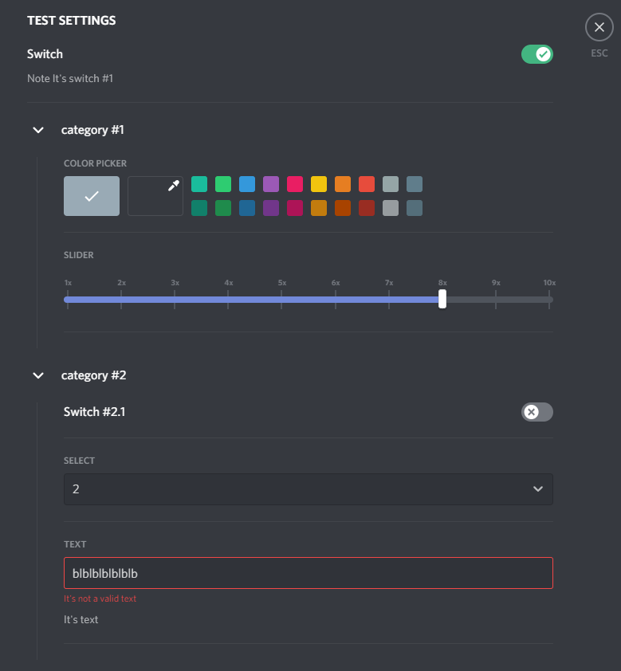

# Settings component

> **Warning**
> Powercord client is EOL and no longer works with latest versions of Discord


A settings component that does routine work for you

## Example
[Example file](test-plugin/index.js)

```js
Settings.register({
  entityID: this.entityID,
  label: 'Test settings',
  items: [
    {
      type: 'switch',
      name: 'Switch',
      note: 'Note It\'s switch #1',
      key: 'switch1',
      def: true
    },
    {
      type: 'category',
      name: 'category #1',
      items: [
        {
          type: 'colorPicker',
          name: 'Color Picker',
          key: 'colorPicker1'
        },
        {
          type: 'slider',
          name: 'Slider',
          key: 'slider1',
          def: 8,
          sequenceNumsUp: 10,
          onMarkerRender: (e) => `${e}x`
        }
      ]
    },
    {
      type: 'category',
      name: 'category #2',
      items: [
        {
          type: 'switch',
          name: 'Switch #2.1',
          key: 'switch21',
          def: false
        },
        {
          type: 'select',
          name: 'Select',
          key: 'select1',
          def: 2,
          items: [
            { label: '1', value: 1 },
            { label: '2', value: 2 },
            { label: '2', value: 2 },
            { label: '2', value: 2 }
          ]
        },
        {
          type: 'text',
          name: ({ getSetting }) => 'Text',
          note: 'It\'s text',
          default: 'blblblblblblba',
          onChange: ({ updateSetting }, value) => ({
            error: 'It\'s not a valid text'
          })
        }
      ]
    }
  ]
});
```



## Real use
- [Image tools](https://github.com/userXinos/image-tools/blob/main/utils/baseSettingsStructure.js) (v1.2)


## Documentation 

> By default, items wait for **`key`** & **`def`** for `getSetting` and `updateSetting`/`toggleSetting`, 
> however you can pass your props for example: **`value`** & **`onChange`**.
> 
> This can be both primitive and the function, the first transmitted argument is always Object 
> 
> ```js
> { getSetting, updateSetting, toggleSetting }
> ```
> 
> The second argument is the value that returns the native function

### Implemented components: 
- [Switch](#Switch)
- [Color Picker](#ColorPicker)
- [Slider](#Slider)
- [Select](#Select)
- [Text](#Text)
- [Radio Group](#RadioGroup)
- [Checkbox](#Checkbox)
- [Category](#Category)
- [Tab Bar](#TabBar)

#
### <a name="Switch">Switch</a>

Param   | Type
--------|--------------
name    | Text/Element
value   | value/Function
onClick | Function

### <a name="ColorPicker">Color Picker</a>

Param         | Type
--------------|--------------
name          | Text/Element
value         | Int/Function
onChange      | Function
defaultColor  | Int
defaultColors | Array<`Int`>

### <a name="Slider">Slider</a>

Param          | Type           | Default | Description
---------------|----------------|---------|------------
name           | Text/Element   |         |
value          | value/Function |         |
onChange       | Function       |         |
keyboardStep   | Number         | 1       |
stickToMarkers | Boolean        | true    |
sequenceNumsUp | Number         |         | Creates an array of sequential numbers markers is equal to the length of the resulting number, the first element is 1

### <a name="Select">Select</a>

Param    | Type
---------|--------------
name     | Text/Element
value    | Int/Function
onChange | Function
items    | Array<`{ label, value }`>

### <a name="Text">Text</a>

Param          | Type           | Default | Description
---------------|----------------|---------|------------
name           | Text/Element   |         |
value          | value/Function |         |
default        | value/Function |         |
onChange       | Function       |         | Expect an object with data `{error}`
debounce       | Number         | 250     | Delay before calling `onChange` (ms)

### <a name="RadioGroup">Radio Group</a>

Param    | Type
---------|--------------
name     | Text/Element
value    | Int/Function
onChange | Function
items    | Array<`{ label, value }`>

### <a name="Checkbox">Checkbox</a>

Param   | Type
--------|--------------
name    | Text/Element
value   | value/Function
onClick | Function

### <a name="Category">Category</a>

Param  | Type                      | Default 
-------|---------------------------|---------
name   | Text/Element              |
items  | Array<`{ name, items }`>  |
opened | Boolean                   | true

### <a name="TabBar">Tab Bar</a>

Param    | Type                  | Default
---------|-----------------------|---------
items    | Array< `TabBarItem` > |
selected | Number                | 0

#### TabBarItem

Param  | Type                     | Default
-------|--------------------------|---------
name   | Text/Element             |
items  | Array<`{ name, items }`> |


