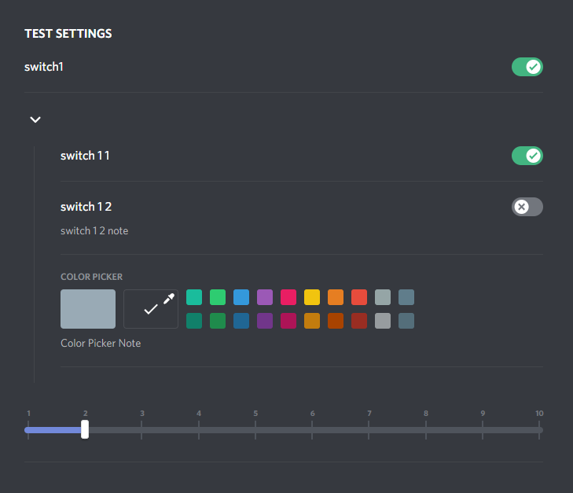

# Settings component



A component that does routine work for you

### Example
[Example file](test-plugin/index.js)
```js
    Settings.registerSettings({
      entityID: this.entityID,
      label: 'Test settings',
      items: [
        {
          type: 'switch',
          name: 'switch 1',
          key: 'switch-1',
          def: true
        },
        {
          type: 'category',
          items: [
            {
              type: 'switch',
              name: 'switch 1 1',
              value: true
            },
            {
              type: 'switch',
              name: 'switch 1 2',
              value: false,
              note: 'switch 1 2 note'
            },
            {
              type: 'colorPicker',
              name: 'Color Picker',
              note: 'Color Picker Note'
            }
          ]
        },
        {
          type: 'slider',
          name: 'Slider',
          sequenceNumsUp: 10,
          value: 2
        }
      ]
    });
```

### Documentation 

> By default, items wait for **`key`** & **`def`** for `getSetting` and `updateSetting`/`toggleSetting`, 
> however you can pass your props for example: **`value`** & **`onChange`**

Implemented components: 
- [Switch](#Switch)
- [Color Picker](#ColorPicker)
- [Slider](#Slider)
- [Select](#Select)
- [Text](#Text)
- [Radio Group](#RadioGroup)
- [Checkbox](#Checkbox)
- [Category](#Category)


<a name="Switch">Switch</a>
- name
- note 
- value
- onClick

<a name="ColorPicker">Color Picker</a>
- name
- note
- value
- onChange
- defaultColor
- defaultColors

<a name="Slider">Slider</a>
- name
- note
- value
- onChange
- renderMarker
- keyboardStep = 1
- stickToMarkers = true

<a name="Select">Select</a>
- name
- note 
- value
- onChange
- items

<a name="Text">Text</a>
- name
- note
- value
- onChange
- default

<a name="RadioGroup">Radio Group</a>
- name
- note
- value
- onChange
- items

<a name="Checkbox">Checkbox</a>
- name
- note
- value 
- onClick

<a name="Category">Category</a>
- name
- note
- items
- opened = true

